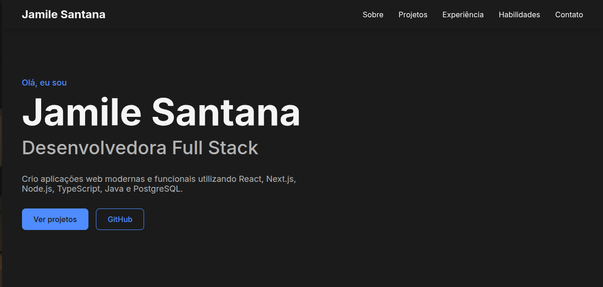

# 💼 Portfólio | Jamile Santana

[](https://react.dev/)
[](https://www.typescriptlang.org/)
[](https://vite.dev/)

Este é o repositório do meu portfólio profissional, desenvolvido para apresentar minha trajetória, experiência, habilidades técnicas e projetos como Desenvolvedora Full Stack.

Além de servir como vitrine dos meus projetos, este portfólio também foi construído como uma forma de colocar em prática boas práticas de desenvolvimento Front-end, com foco em organização, acessibilidade, responsividade e experiência do usuário.

## 🔗 Acesse

🌐 **Portfólio:** *(disponível após o deploy)*

💻 **GitHub:** https://github.com/Jhamyllie

🔗 **LinkedIn:** https://www.linkedin.com/in/jamile-santana-da-silva/*

## 📷 Preview

<p align="center">
  
</p>

https://portfolio-eta-inky-51.vercel.app/

## ✨ Funcionalidades

- Apresentação profissional
- Seção "Sobre mim"
- Experiência profissional
- Projetos com links para GitHub e demonstrações
- Lista de habilidades técnicas
- Área de contato
- Navegação entre as seções da página
- Layout responsivo
- Navegação acessível por teclado

## 🛠️ Tecnologias

- React
- TypeScript
- Vite
- HTML5
- CSS3
- ESLint

## 📁 Estrutura do projeto

```text
src
├── assets
├── components
│   ├── About
│   ├── Contact
│   ├── Experience
│   │   └── ExperienceCard
│   ├── Footer
│   ├── Header
│   ├── Hero
│   ├── Projects
│   │   └── ProjectCard
│   └── Skills
├── data
├── styles
├── App.tsx
└── main.tsx
```

## 🚀 Como executar o projeto

### Pré-requisitos

- Node.js
- npm
- Git

### Clone o repositório

```bash
git clone https://github.com/Jhamyllie/portfolio.git
```

### Entre na pasta

```bash
cd portfolio
```

### Instale as dependências

```bash
npm install
```

### Execute o projeto

```bash
npm run dev
```

Após iniciar o servidor, acesse o endereço informado no terminal.

## 🎯 Objetivos do projeto

Este projeto foi desenvolvido com dois objetivos principais:

- reunir minha experiência, habilidades e projetos em um único lugar;
- aplicar conceitos fundamentais do desenvolvimento Front-end em um projeto real.

Durante o desenvolvimento foram trabalhados aspectos como:

- Componentização com React;
- Organização da arquitetura da aplicação;
- Responsividade;
- Acessibilidade;
- Semântica HTML;
- Estruturação de CSS;
- Reutilização de componentes;
- Organização de código;
- Boas práticas de desenvolvimento.

## ♿ Acessibilidade

Durante o desenvolvimento foram adotadas práticas como:

- HTML semântico;
- navegação por teclado;
- estados de foco visíveis;
- textos alternativos em imagens;
- uso de atributos `aria-label`;
- contraste adequado entre texto e fundo.

## 📱 Responsividade

A interface foi desenvolvida para proporcionar uma boa experiência em diferentes tamanhos de tela:

- Desktop;
- Tablet;
- Smartphone.

## 📌 Próximas melhorias

- Publicação na Vercel;
- Adição do preview do projeto;
- Tradução para inglês;
- Inclusão de novos projetos;
- Implementação de testes automatizados;
- Utilização de domínio próprio.

## 👩‍💻 Aprendizados

O desenvolvimento deste portfólio foi uma oportunidade para consolidar conhecimentos em React e TypeScript, além de aprofundar práticas relacionadas à organização de componentes, arquitetura Front-end, responsividade, acessibilidade e refinamento da interface.

Mais do que apresentar meus projetos, este repositório representa minha forma de desenvolver: buscando escrever código organizado, reutilizável e de fácil manutenção.

## 📬 Contato

- **GitHub:** https://github.com/Jhamyllie
- **LinkedIn:** *https://www.linkedin.com/in/jamile-santana-da-silva/*
- **E-mail:** *jamilesan204@gmail.com*

---

Desenvolvido por **Jamile Santana**.